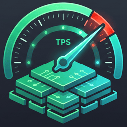

<div align="center">



# TokTuner

[](https://opensource.org/licenses/MIT)
[](https://www.python.org/downloads/)
[](pyproject.toml)
[](ARCHITECTURE.md)

**Computes the fastest `llama.cpp` flags for your machine. In milliseconds. Without running the model.**

</div>

---

Point it at any `.gguf`, choose your context length, and get the single optimal command:

```bash
toktuner --model model.gguf --ctx 4096
```

```bash
llama-server -m model.gguf -ngl 99 -c 4096 -fa on --parallel 1 -ncmoe 19 --load-mode dio
```

- ⚡ **No benchmarking.** Reads GGUF headers and analytically solves for the optimal memory layout. Under 50 milliseconds, not half an hour.
- 📦 **Zero dependencies.** 100% Python standard library. Nothing to install, no PyPI packages, no CUDA build step.
- 📐 **Deterministic arithmetic.** Pure mathematics over your hardware and tensor layouts. Same inputs, same optimal answer, every time.
- 🛑 **Nothing is loaded.** A 60 GB model is inspected instantly; zero VRAM allocated, no GPU warmup, no inference cycles burned.

---

## Why This Can Be Computed Rather Than Measured

Decode throughput in local LLMs is **memory-bandwidth bound**. The time per token is:

$$t = \sum_i \left[ x_i \cdot \frac{b_i}{\text{BW}_{\text{gpu}}} + (1 - x_i) \cdot \frac{b_i}{\text{BW}_{\text{cpu}}} \right] + c$$

where $x_i \in \{0, 1\}$ indicates whether tensor group $i$ resides in VRAM, and $b_i$ is the bytes read per token. Minimizing time per token is mathematically equivalent to maximizing GPU residency savings:

$$\text{maximize } \sum_i x_i \cdot s_i \cdot f_i \quad \text{subject to } \sum_i x_i \cdot s_i \le M$$

$$\left( s_i = \text{size in bytes}, \quad f_i = \text{reads per token}, \quad M = \text{usable VRAM} \right)$$

The bandwidth constants cancel out. What remains is a **0-1 Knapsack Problem** where the value density simplifies to:

$$\frac{\text{Value}}{\text{Weight}} = \frac{s_i \cdot f_i}{s_i} = f_i \quad (\text{Token Read Frequency})$$

> **The value per byte of VRAM is exactly its token read frequency ($f_i$).**

| Tensor Group | Reads / Token ($f_i$) | VRAM Priority | Placement Strategy |
| :--- | :---: | :---: | :--- |
| **Attention, Dense FFN, Shared Experts, KV Cache** | **$1.0$** | **Highest (1st)** | **Always pinned in VRAM** |
| **Routed MoE Experts** (e.g. top-8 of 256) | **$8/256 = 0.031$** | **$32\times$ Lower** | **Offloaded to RAM via `-ncmoe`** |

### Two Crucial Derived Consequences

1. **Dense models should use `-ncffn`, not `-ngl`:**
   Whole-layer offloading (`-ngl`) drops whole layers *including their attention and KV cache*. Because the KV cache is read on every single token ($f = 1.0$), exiling it to system RAM cuts throughput in half. `-ncffn` offloads only FFN weight while keeping all attention and KV resident in VRAM.
2. **The CPU block must be contiguous:**
   All offloadable layers share identical read frequencies, so the knapsack is indifferent among them. The tie breaks on CPU $\leftrightarrow$ GPU boundary-crossing overhead; one contiguous block means exactly one boundary crossing per token.

---

## Architectural Precision

KV cache sizing is where memory calculators fail most often. `TokTuner` models 50+ architectures directly from GGUF metadata:

| Attention Mechanism | Cost per Token per Layer | Why Standard Tools Fail |
| :--- | :--- | :--- |
| **MHA / GQA / MQA** | `n_head_kv × (key_len + value_len)` | Baseline |
| **DeepSeek MLA** | `kv_lora_rank + rope_dim` | Naive GQA formulas **overestimate by 3–5×** |
| **Sliding Window (SWA)** | Capped at window size | Remains constant once context exceeds window |
| **Recurrent (SSM / RWKV)** | Fixed state size | Does not grow with context length at all |
| **Hybrid (Qwen 3.5+, Gemma)** | Layer-by-layer mask | Heterogeneous per-layer heads (up to **20× difference**) |

### Sizing Without Type Tables
Tensor sizes come from **offset deltas in the GGUF tensor table**, not hardcoded ggml type tables. This makes `TokTuner` 100% invariant to new or custom quantization types (`MXFP4`, `IQ1_S`, etc.).

---

## What `TokTuner` Prevents

* **Driver Reserve Blindness**: GPUs never surrender 100% of advertised VRAM (e.g. 0.30 GB withheld on 12 GB cards). `TokTuner` budgets a calibrated $2.5\%$ driver reserve.
* **Silent Spilling**: `llama.cpp` does not throw an error when VRAM is short by 100 MB; it quietly moves the KV cache to CPU RAM and cuts generation speed by ~50%. `TokTuner` ensures plans never silently spill.
* **Leftover VRAM Waste**: Remaining megabytes that cannot fit another layer are automatically absorbed by raising micro-batch size (`-ub 1024/2048`), boosting prompt prefill throughput.
* **CPU Core Contention**: Vendor-aware thread selection pins **Intel** hybrid CPUs to P-cores only (preventing E-core memory bus contention) while utilizing all **AMD** Zen-c cores (which share identical IPC).

---

## Hardware Scope & Requirements

> [!NOTE]
> **For now, TokTuner is focused on Single Discrete NVIDIA GPU + System RAM setups** on Windows and Linux.

* **Target Systems**: Any desktop or laptop with a single discrete NVIDIA GPU (RTX 30/40/50 series, GTX 16/20 series, Tesla, A-series, H-series, etc.) running Windows or Linux.
* **Dual-GPU Laptops (iGPU + dGPU)**: If your machine has an integrated GPU (e.g. AMD Radeon 890M / Intel Iris) alongside a discrete NVIDIA card, `TokTuner` automatically targets the NVIDIA card and leaves the display/iGPU alone.
* **Why Single GPU for now?**: Single discrete GPUs are where silent KV cache spilling and suboptimal offloading cause the most severe performance degradation. Multi-GPU tensor parallelism (`-ts`) and unified memory platforms (Apple Silicon) are on the future roadmap.

---

## Usage

### Desktop GUI
Run the standalone desktop application (or `toktuner --gui`):

```bash
toktuner --gui
```
Select your `llama-server` folder, pick a `.gguf`, select your context, and click **Plan**. Copy the command or save it as a `.bat` / `.sh` script.

### Command Line Interface

```bash
# Plan for default 4096 context
toktuner --model model.gguf

# Plan for specific context length
toktuner --model model.gguf --ctx 32768

# Generate plans across all standard context ladders
toktuner --model model.gguf --all

# Print only the raw runnable command (for scripts)
toktuner --model model.gguf --quiet

# Hold back extra safety VRAM
toktuner --model model.gguf --safety 0.5
```

---

## Installation & Downloads

### Option 1: Standalone Binaries (Zero Dependencies, No Python Required)
Download the standalone executable directly from [Releases](https://github.com/HarinManiK/TokTuner/releases/latest):

* **🪟 Windows**: Download `toktuner.exe` and double-click to open the GUI, or run from PowerShell/cmd.
* **🐧 Linux (x86_64)**:
  ```bash
  # Download standalone binary
  curl -L -o toktuner https://github.com/HarinManiK/TokTuner/releases/latest/download/toktuner-linux-x86_64
  chmod +x toktuner

  # Launch desktop GUI (on desktop distros)
  ./toktuner --gui

  # Or run in terminal (works on both desktops and headless servers)
  ./toktuner --model /path/to/model.gguf --ctx 4096
  ```

### Option 2: Install via pip (Python 3.10+)
```bash
git clone https://github.com/HarinManiK/TokTuner.git
cd TokTuner
pip install -e .
```

### Option 3: Build from Source
```bash
python build_exe.py
# Produces dist/toktuner.exe (on Windows) or dist/toktuner (on Linux)
```

---

## Verification & Testing

`TokTuner` includes three exhaustive test suites:

```bash
# 1. Synthetic universality suite (36 architecture families & invariants)
python tests/test_universal.py

# 2. Ground-truth validation (13 real measured hardware allocations; worst-case error 0.27 GB)
python tests/test_ground_truth.py

# 3. Adversarial audit suite (356 checks against degenerate shapes & llama.cpp flag syntax)
python tests/audit.py
```

---

## Attribution & Citation

If you use `TokTuner` in your research, software, or benchmark pipeline, please cite it using:

```bibtex
@software{toktuner2026,
  author = {TokTuner contributors},
  title = {TokTuner: Analytical llama.cpp Flag & Memory Layout Compiler},
  url = {https://github.com/HarinManiK/TokTuner},
  year = {2026}
}
```

---

## License

MIT License. See [LICENSE](LICENSE) for details.
